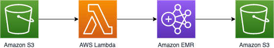

# Welcome to CDK-EMR-S3-TRIGGER project!

This is a Typescript CDK Project for EMR triggered by S3 file upload.

The `cdk.json` file tells the CDK Toolkit how to execute your app.

## Overall Architecture


Source S3 Bucket triggers the Lambda function which executes EMR job.
The result of EMR job will be placed into Destination S3 Bucket

## How to Deploy

1. Set your configuration at `manifest.json`
```json
{
  "config": {
    "bucket": {
      "source": "PUT_YOUR_SOURCE_BUCKET_NAME_HERE",
      "destination": "PUT_YOUR_DESTINATION_BUCKET_NAME_HERE",
      "job": "PUT_YOUR_JOB_BUCKET_NAME_HERE"
    },
    "job": {
      "file": "SparkSimpleJob-1.0.0.jar" // sample job name
    },
    "deploy": {
      "version": "1",
      "environment": "dev"
    }
  }
}
```
Put your source bucket name into **config.bucket.source**, your destination bucket name into **config.bucket.destination** and job bucket name into **config.bucket.job** which contains EMR job scripts

And set your deploy configuration

2. Check if you have necessary IAM Roles to run EMR.
```python
# hello_emr.py
JobFlowRole='EMR_EC2_DefaultRole',
ServiceRole='EMR_DefaultRole',
```
If you have ever created an EMR cluster in your account, you have EMR_EC2_DefaultRole and EMR_DefaultRole. Create if you don't have it.

* `npm install` install npm modules
* `cdk bootstrap` deploy cdk toolkit stack
* `cdk deploy` deploy this stack to your default AWS account/region
* `cdk destroy` deploy this stack from your default AWS account/region

## How to Run EMR Job
Upload ./demo/input.txt into source S3 bucket.
It will trigger the pipeline.